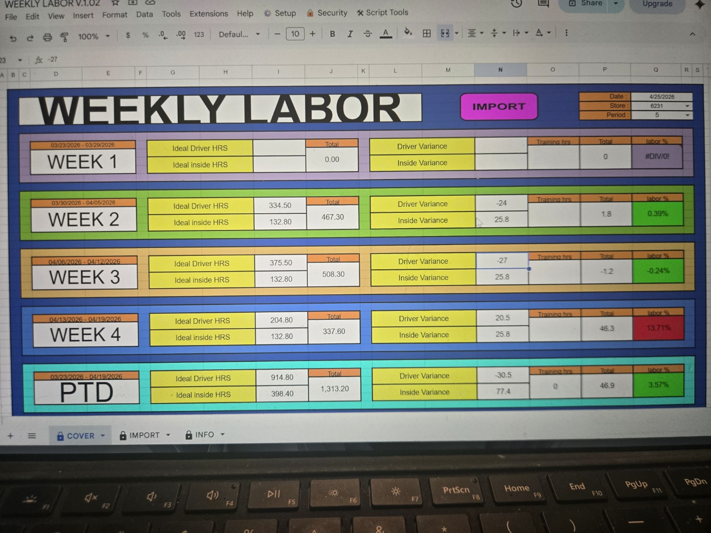
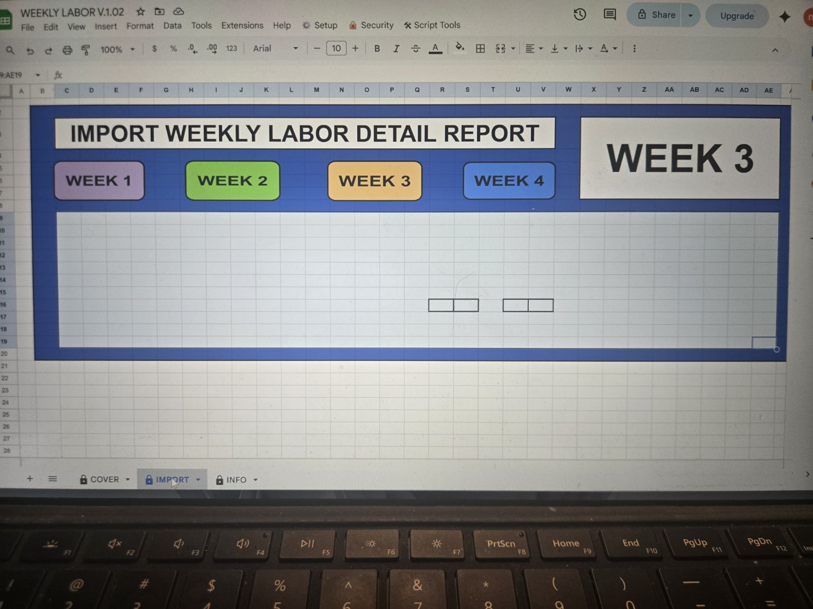
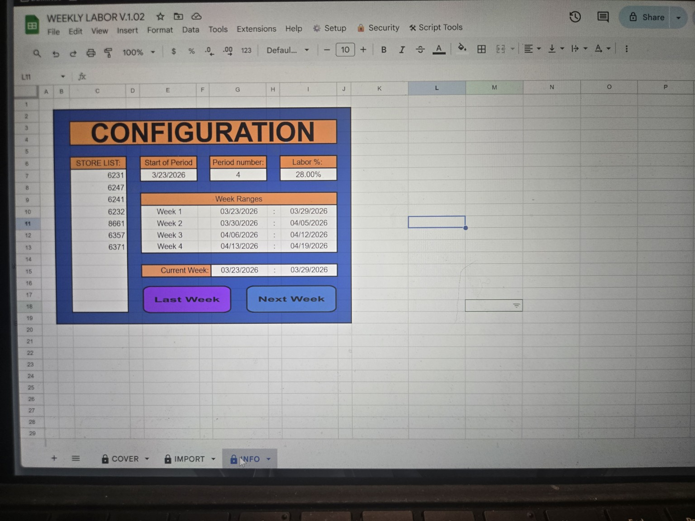

# Weekly Labor Tracker

A real-world labor tracking and validation system built for high-volume store operations using Google Sheets + Apps Script.
---

## 🚀 Live Demo
[Open Demo Sheet](https://docs.google.com/spreadsheets/d/18NkekscpctaEmX9XEanS83Xy-vIcYP7Lluh2h08aj9Q/edit?usp=sharing)

*To test functionality: open the sheet and create your own copy.*

---

## 📌 Project Status
Current Version: **v1.0**  
Status: **Stable / In-use (live store environment)**

---

## 🔧 Core Capabilities
- Tracks weekly labor across a 4-week period
- Automates validation for required labor inputs
- Prevents incomplete or incorrect imports
- Restores full sheet structure and formatting
- Includes protected workflow controls

---

## 🛠️ Built With
- Google Apps Script
- Google Sheets

---

## 💡 Why I Built This
Built from real operational experience managing weekly labor in a high-volume store environment.

It automates validation, formatting, structure, and controlled data entry—reducing mistakes and improving consistency in day-to-day labor tracking.
---

## ⚙️ Key Features
- Automated sheet restoration via script
- Password-protected sheet locking system
- Live visual validation for weekly inputs
- Import validation before data transfer
- Dynamic 4-week period tracking
- Week-based import workflow
- Built-in version tracking system

---

## 🚀 How to Use

1. Open the Google Sheet
2. Make your own copy
3. Run `InitializeThisFile()`
4. Set password when prompted
5. Navigate to the IMPORT tab
6. Select the correct week
7. Enter or paste labor data
8. Use the import button to transfer data to COVER

---

## 📸 Screenshots

---

### Cover Sheet (Weekly Labor Overview)

Displays weekly labor totals, ideal hours, variances, training hours, labor percentage, and period-to-date totals.

---

### Import Sheet (Data Entry Interface)

Interface for selecting a week and importing weekly labor detail into the COVER sheet.

---

### Info Sheet (System Configuration)

Controls store list, period number, start date, labor percentage, week ranges, and current week display.

---

### Validation Feedback

Highlights incomplete weekly input groups and prevents bad imports before data is transferred.

---

### Version Display Popup

Displays the current system version and tracks update history.

---

## 📜 Version History

### v1.0 — 04.25.2026
- Initial public GitHub release
- Core weekly labor tracking system
- Automated sheet restoration
- Protected workflow system
- Import validation and live input validation
- Dynamic 4-week period tracking
- Integrated version tracking system

---

## ⚠️ Notes
- This system depends on a specific spreadsheet structure (sheet names, ranges, and layout).
- Code is provided as a reference implementation of the system logic.
- Demo sheet is a sanitized version with no real store or company data.

---

## 📫 Contact

📧 [Email Me](mailto:michael.e.freese.tech@gmail.com)

Open to feedback, collaboration, and opportunities.
